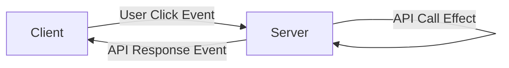

# Fennec
<p align="center">
  
</p>

> Client-server Functional Reactive Programming (FRP) library

## State of the project

```diff
! This project is currently just an investigation. I have yet to write any small or large applications with Fennec
! but of course I hope to do so in the future.
! If and when it matures, I will start making some releases. For now, it's open sourced as inspiration.
```
## Inspiration

To give you a quick idea of what inspiration this library draws upon:

* [Phoenix](https://www.phoenixframework.org/) (Elixir)
* [Laminar](https://laminar.dev/)
* [Elm Architecture](https://guide.elm-lang.org/architecture/)
* [React](https://reactjs.org/)
* [Redux](https://redux.js.org/)

## Philosophy

> Communicate efficiently and often

### Comparison with Phoenix Liveview

Fennec seems to land closest to [Phoenix Liveview](https://hexdocs.pm/phoenix_live_view/Phoenix.LiveView.html) with its
utilization of server-side state. The main differences being choice of language and communication vehicle (binary vs
HTML).

|                      | Fennec                 | Phoenix Liveview          |
|----------------------|------------------------|---------------------------|
| **VM**               | JVM/.js engine         | Beam                      |
| **Message passing**  | Bring your own         | Erlang Actors, VM support |
| **Over the wire**    | Messages (binary)      | HTML                      |
| **Client side code** | Cross compiled         | Framework provided        |
| **Process model**    | Fibers (green threads) | Erlang Actors             |

While `Phoenix Liveview` relies on a piece of static JavaScript on the client that can render HTML from the server,
`Fennec` relies on shared state model where the client renders the `HTML` based on shared state with the server.

In `Fennec`, events can occur either on the client _or_ the server. If the event originates on the server, it is pushed
to the client and vice versa. This way, the client and server states are kept in sync _on every event_.
The state transitions are shared code between the client and server, cross-compiled to both `JVM byte code`
and `JavaScript`.

## Kernels

The core of `Fennec` is the `Kernel`. A `Kernel` defines the shared `State` and `Event` model as well as state
transitions.
This part of the `Kernel` is cross-compiled. On the server and the client, the `Kernel` can then be composed with
side-effects
that may produce new events like:

* API calls from the `server`
* API calls from the `client`
* User browser interactions on the `client`
* Push events on the `server`
* Database reads on the `server`
* etc...

One example flow could be:



> Q: "Why don't you just send the API request directly from the Client?"

> A: Indeed, you could! But, there could be trust or performance issues, maybe the server is on a closed network,
> maybe there's a better library for that API on the JVM?

> Q: "This just looks like HTTP requests with extra steps?"

> A: Yes, but messages are passed through web-sockets, i.e. no large headers or connection establishing necessary.
> We also have a great deal of control over the serialization format which again can lead to performance gains.

## Some numbers

There are no benchmarks or solid numbers for `Fennec` yet, but the main idea is to use `Websocket` for everything,
eliminating
expensive headers and connection latencies.
For the current classical `Counter` example:

```scala
object CounterKernel:

  case class State(count: Int)
  
  enum Event:
    case Increment
    case Decrement
  
  val update: Update[State, Event] = state =>
    case Event.Increment => State(state.count + 1)
    case Event.Decrement => State(state.count - 1)
  
  val kernel: Kernel[cats.Id, State, Event, Unit] =
    Kernel
      .init[State, Event]("counter", State(0))
      .withUpdate(update)

end CounterKernel
```

There's basically 2 types of messages between the server and the client:

* Handshake to start session
    * This includes the full serialized state from last time we saw this uder
* User events (`Increment`, `Decrement`)

With the current implementation and my home-cooked binary protocol, we get these numbers:

| Event      | Bytes |
|------------|-------|
| Handshake  | 21    |
| User event | 11    |

For this app, the numbers are static since neither the state, nor the events are dynamic. In the future, I hope to 
have some more interesting numbers and possibly some benchmarks.

